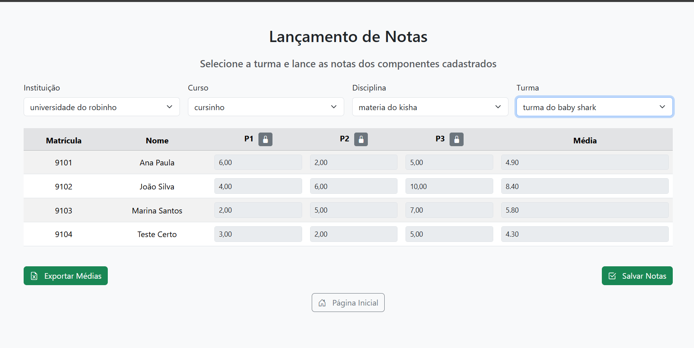

# Nota Dez

Empoderando a educação através de uma gestão de notas simples e
eficiente.

## Visão Geral

O sistema nota dez é uma ferramenta full-stack criada para facilitar a gestão de
dados educacionais, principalmente notas de alunos. Facilita também o controle do docente 
de suas instituições de trabalho, dos cursos que participa em cada uma delas e quais disciplinas ministra,
organizando assim de forma eficiente todas as trumas ligadas diretamente a ele. Permite que 
o docente aplique quantas atividades avaliativas/ provas desejar, de forma livre. O docente pode
escolher entre média ponderada (distribuindo os pesos em cada atividade) ou aritimética, e após o
lançamento das notas, o sistema nota dez ja entrega as médias calculas por aluno e prontas para serem
exportadas em arquivo CSV. 
O sistema combina uma API backend robusta com interfaces frontend intuitivas, permitindo integração 
fluida e automação eficiente de fluxos de trabalho em plataformas acadêmicas.



## Funcionalidades do projeto
- Cadastro de trabalho: instituição de ensino, curso que atua e disciplina ministrada, todos integrados
e ligados um ao outro de forma hierárquica, não permitindo a exclusão ou edição deles sem que seja respeitada
a ordem de criação.
- Função de login: cadastro do usuário não permite acesso anônimo em nenhuma tela, com sistema de recuperar a
senha via e-mail caso o usuário a perca/esqueça.
- Componentes de notas: cada disciplina possui seus próprios componentes de notas ilimitados, sendo compartilhados por 
suas turmas.  
- Médias: a funcionlidade da média exige que o usuário indique qual tipo de média vai desejar dentro das opções PONDERADA
ou ARITIMÉTICA, não existindo outra opção. Se desejar a opção de média PONDERADA, vai distribuir os pesos entre os
componentes em porcentagem (ex: 20, que indicaria 20%) de forma livre, contudo a soma de todos os pesos devem dar
exatamente 100%, o sistema não permite a criação dos componentes se essa soma não estiver exata.
- Cadastro de alunos: o cadastro de alunos pode ser feito de forma manual/ individual, sendo necessário 
indicar a MATRÍCULA e o nome completo do mesmo. A matrícula não poderá se repetir, só irá existir um aluno com
aquela matrícula. O cadastro de alunos pode ser feito também via importação de arquivo, esse sistema só suporta 
a extensão de arquivo CSV, que deve possuir 2 colunas principais e iniciais com os nomes MATRÍCULA e NOME, qualquer
outra coluna no arquivo será desconsiderada.
- Exportação de médias/ notas: o sistema permite a exportação de notas somente quando todos os componentes de notas
forem preenchidos de todos os alunos daquela turma, e as médias finais calculadas. A existência de qualquer campo de 
componente de notas em branco, impede a exportação. Assim que for desejada a exportação, será feito o download imediado
de um arquivo CSV com todos os alunos, suas matrículas, as notas lançadas e as respectivas médias finais de cada um.
- Armazenamento: todos os dados são armazenados no banco de dados de linguagem MySQL.
- Auditoria: possui um sistema de auditioria com as informações salvas em tempo real no banco de dados, sempre que uma
nota for adicionada ou alterada de um aluno, mostrando a data, hora, qual foi o aluno, a nota antiga e a nota nova que 
tiveram a alteração.

## Acesso ao projeto

O projeto pode ser acessado por esse link: https://github.com/Leonardo-rgb-code/01-ES-PI2-2025-T03-G13-Novo-

## Tecnologias utilizadas

HTML, BOOTSTRAP 5, JAVASCRIPT, NODE.JS, TYPESCRIPT, MYSQL

## Ambiente de criação

Base de códigos: VSCode
Banco de dados: MySQL Workbench
Testes: Navegador Google Chrome
Desenvolvimento em equipe e divulgação: GitHub

## Autores

Projeto desenvolvido pelo grupo 13 da PUC Campinas, do Primeiro semestre, para a 
disciplina Projeto Integrador II
Integrantes: Bruno Terra, Gabrielle Mota, Leonardo Fonseca, Matheus Ferreira, Rafael Cypriano

### Pré-requisitos

- VSCode
- Node.js
- TypeScript
- npm (e suas bibliotecas)

### Instalação

``` sh
git clone https://github.com/Leonardo-rgb-code/01-ES-PI2-2025-T03-G13-Novo-.git
cd 01-ES-PI2-2025-T03-G13-Novo-
npm install
```

### Uso

``` sh
npm start
```
E iniciar o live server do frontend pelo vscode